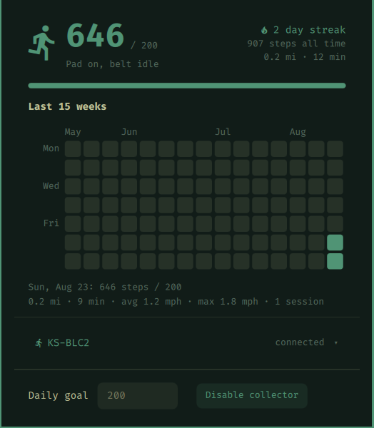

# WalkingPad widget for Omarchy

KingSmith WalkingPad steps in your Omarchy bar: live step counter, daily goal
tracking, and a GitHub-style history graph. All data stays on your machine.




## Features

- **Auto-connect**: a lightweight daemon idles in a BLE scan loop and connects
  the moment your pad powers on. No pairing rituals, no app.
- **Live counter in the bar**: today's steps (or `current/goal` once you set a
  goal), footprints icon while you walk, theme accent color when the goal is
  met, dimmed when the collector is off.
- **History popup** (left-click): today's progress, live session stats
  (speed / distance / session time), a 15-week contribution graph where goal
  days glow in your theme's accent color, hover any day for its exact count,
  streak and all-time totals.
- **Daily goal**: set it in the popup; crossing it mid-walk fires a desktop
  notification.
- **Enable/disable switch**: right-click the widget (or use the popup button)
  to start/stop the collector. Stopping it ends all BLE scanning and frees the
  pad for the KS Fit app.
- **Pad picker**: multiple pads nearby? Pick yours from the popup, or stay in
  auto mode (strongest signal wins).
- **Crash-safe local history**: every status update is recorded the instant
  it arrives, and each day is compacted into per-day stats at day rollover.
  The pad's own memory is volatile, so this is what protects your sessions.

## Supported pads

Anything the [walkingpad-controller](https://github.com/mcdax/walkingpad-controller)
library speaks: KingSmith pads over the legacy WiLink protocol (A1, A1 Pro,
C1, C2, R1, S1, ...), newer FTMS models (Z1, MC-21, ...), and Sperax P3 Max.
Protocol is auto-detected.

## Requirements

- Omarchy (Arch + Hyprland + the omarchy-shell Quickshell bar)
- A Bluetooth adapter (`bluez`, present on any Omarchy install)
- Python 3.10+

## Install

```sh
omarchy plugin add https://github.com/msegoviadev/omarchy-walkingpad.git --enable
```

Then set up the collector backend (Python venv + systemd **user** service):

```sh
~/.config/omarchy/plugins/msegoviadev.walkingpad/backend/install.sh
```

The installer creates a venv in `~/.local/share/walkingpad/`, installs the BLE
library there, and registers `walkingpad.service` so the collector starts at
login. Everything runs unprivileged as your user; no data leaves the machine.

## Usage

| Action | Result |
|--------|--------|
| Left-click widget | Open/close the history popup |
| Right-click widget | Enable/disable the collector |
| Middle-click widget | Refresh stats |
| Walk | Everything else happens by itself |

## Configure

Set your daily goal from the popup, or inline in `~/.config/omarchy/shell.json`:

```json
{ "id": "msegoviadev.walkingpad", "goalSteps": 6000, "units": "Auto" }
```

`units` accepts `Auto` (follows your system locale: US English gets mph and
feet/miles), `Metric`, or `Imperial`. All data is stored in metric; the
setting only changes display.

Move the widget between bar sections:

```sh
omarchy bar move msegoviadev.walkingpad --section center
```

## Remove

```sh
omarchy plugin remove msegoviadev.walkingpad
systemctl --user disable --now walkingpad
rm ~/.config/systemd/user/walkingpad.service && systemctl --user daemon-reload
rm -rf ~/.local/share/walkingpad   # deletes your step history
```

## How it works

```
pad (BLE) -> collector.py (systemd user service)
                -> ~/.local/share/walkingpad/history.jsonl   (today's records;
                   older days are compacted into rollup.json and dropped)
                -> ~/.local/share/walkingpad/status.json     (live state)
                -> ~/.local/share/walkingpad/devices.json    (seen pads)
                -> ~/.local/share/walkingpad/rollup.json     (per-day stats,
                   rebuilt at startup and day rollover)
stats.py  -> merges rollup + today's raw tail into today/days/streak/totals JSON
Panel.qml -> renders the bar widget and popup from that JSON
```

Only one BLE client can be connected to the pad at a time: while the
collector is connected, the KS Fit phone app cannot connect (and vice versa).
Stop the collector if you want to use the app.

## Troubleshooting

```bash
journalctl --user -u walkingpad -f        # collector logs
systemctl --user status walkingpad        # service state
omarchy-shell shell summon msegoviadev.walkingpad '{}'   # open the popup
omarchy-shell shell hide msegoviadev.walkingpad          # close it
```

- **Widget shows 0 / pad off**: the pad only advertises while powered on.
  Turn it on and watch the logs; "Found pad" should appear within ~15s.
- **Pad not detected**: if your model advertises an unusual name, pick it from
  the popup's pad list, or add `"device_address": "AA:BB:CC:DD:EE:FF"` to
  `~/.config/walkingpad/config.json` by hand.
- **Lost a session?** Sessions are recorded live once per second, so this
  should not happen while the collector runs. A session walked with the
  collector off is only recoverable if the pad kept power: its last-run
  summary is fetched automatically on the next connect.
